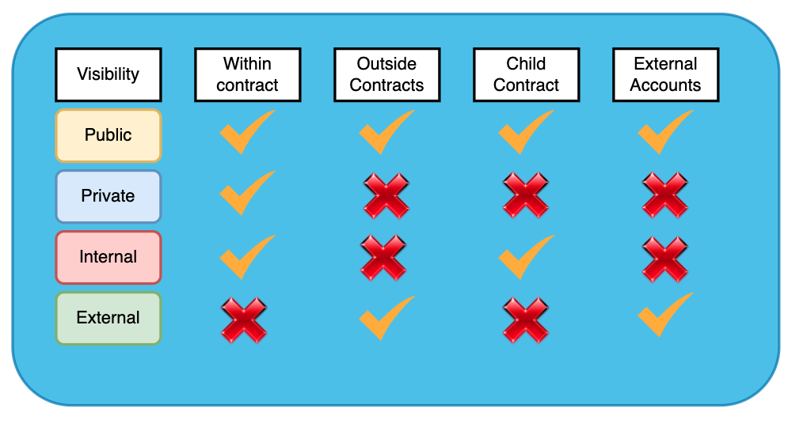

# Solidity Visibility Keywords

In Solidity, there are four visibility keywords that can be used to control the accessibility of functions and state variables within a contract: `public`, `private`, `internal`, and `external`. Here's a brief explanation of each:

## Public
The `public` visibility keyword allows functions and state variables to be accessed from both within the contract and externally. This means that they can be called by other contracts and accounts. Additionally, public state variables automatically generate a getter function that allows their values to be read.

## Private
The `private` visibility keyword restricts the access of functions and state variables to only within the contract they are defined in. They cannot be accessed or called from external contracts or accounts. Private state variables are not automatically generated with a getter function.

## Internal
The `internal` visibility keyword allows functions and state variables to be accessed from within the contract they are defined in, as well as from any contracts that inherit from it. However, they cannot be accessed from external contracts or accounts. Internal state variables are not automatically generated with a getter function.

## External
The `external` visibility keyword is similar to `public`, as it allows functions to be accessed externally. However, unlike `public`, external functions cannot be called internally within the contract. External functions are typically used for contract-to-contract communication, as they provide a lower gas cost compared to public functions.

