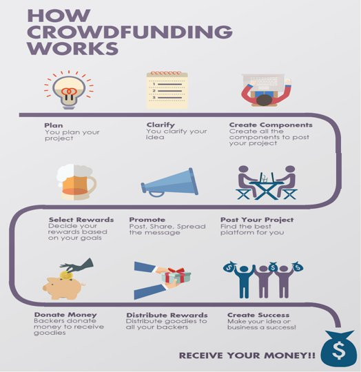

##OVERVIEW 

- an organization collects money from crowd (business and individuals)
- after collecting money, it spends the money on the charity projects

##WORKING
- the manager (from the crowdfunding org) sets the target funding, deadline and minimum contribution to be collected
- the contributors/people will transfer funds/ether directly to the Smart contract
- manager can only extract ether from smart contract when more than 50% contributors agree by voting, else manager cannot transfer money
- the contributors can get their money back from smart contract only if the target funding within the deadline is not achieved within the given deadline.

##GLIMPSE
